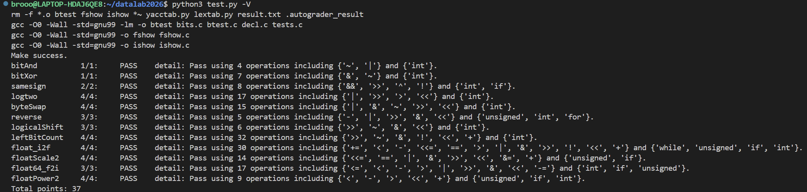

# datalab 报告

姓名：张玉渤

学号：2025201876

| 总分 | bitAnd | bitXor | samesign | logtwo | byteSwap | reverse | logicalShift | leftBitCount | float_i2f | floatScale2 | float64_f2i | floatPower2 |
| --- | --- | --- | --- | --- | --- | --- | --- | --- | --- | --- | --- | --- |
| 37.00 | 1.00 | 1.00 | 2.00 | 4.00 | 4.00 | 3.00 | 3.00 | 4.00 | 4.00 | 4.00 | 3.00 | 4.00 |


test 截图：



## 解题报告

### 亮点

1. logtwo
2. leftBitCount

### logtwo

```c

int logtwo(int v) {
    int a = (v>0xFFFF)<<4;
    v = v>>a;
    int b = (v>0xFF)<<3;
    v = v>>b;
    int c = (v>0xF)<<2;
    v = v>>c;
    int d = (v>3)<<1;
    v = v>>d;
    int e = v>1;
    int res = a|b|c|d|e;
    return res;
}
```
这道题需要求正整数以 2 为底的对数并向下取整，也就是寻找最高位 1 的位置。用二分思想来实现，依次判断最高位是否位于高 16 位、高 8 位、高 4 位和高 2 位，并根据判断结果把v右移相应位数来判断后面的一半位数。比较结果为 0 或 1，通过左移得到 16、8、4、2、1，由于不能使用加法，最后用按位或组合为结果。


### leftBitCount
```c
int leftBitCount(int x) {
    int count = 0;
    int step;

    step = !(~(x >> 16)) << 4;
    count = count + step;
    x = x << step;

    step = !(~(x >> 24)) << 3;
    count = count + step;
    x = x << step;

    step = !(~(x >> 28)) << 2;
    count = count + step;
    x = x << step;

    step = !(~(x >> 30)) << 1;
    count = count + step;
    x = x << step;

    step = !(~(x >> 31));
    count = count + step;
    x = x << step;

    count = count + ((x >> 31) & 1);

    return count;
}

```
这两个题目在我看来很像，logtwo是找最高位的1的位置，leftBitCount是找最高位开始连续的1的个数，一开始我想这不就是找最高位的0的位置吗，于是我把x按位取反复用了logtwo的代码，测试不通过后我发现了问题：如果输入最高位不为1（输入是正数）的话，不满足logtwo中对输入数为正的要求（做右移会在高位补1）。

于是我换成了这种实现方式，先判断高16、8、4、2位是否全为1，若是则左移对应位数判断后面的位数，若不是则停留在这一半位置判断，并且每次把count增加对应的个数（包括0）.


## 反馈/收获/感悟/总结
做作业时我想既然用C语言实现，为什么有那么多功能限制，让我很头疼，我猜想可能这种方式更接近计算机的底层逻辑，或许是一种实现效率更高的办法。求助了AI后我得到了答复：这些限制的主要目的并不只是提高程序运行效率，而是让我们暂时离开平时习惯使用的高级语法，直接从数据的二进制表示出发思考问题，对补码、位移、掩码和浮点数表示有更深入的认识。


## 参考的重要资料

 1.课件里展示的几个例子让我熟悉了这种位运算写法，还有操作比如提取特定字节的方式被我用在了代码里

 2.[IEEE 754 浮点数标准简介](https://en.wikipedia.org/wiki/IEEE_754)除了课件里介绍的32位精度的浮点数表示，我也了解了IEEE 754中64位双精度浮点数的组成，包括1位符号位11位指数和52位尾数，以及指数偏置和隐藏最高位等内容，帮助我完成了`float64_f2i`函数。

